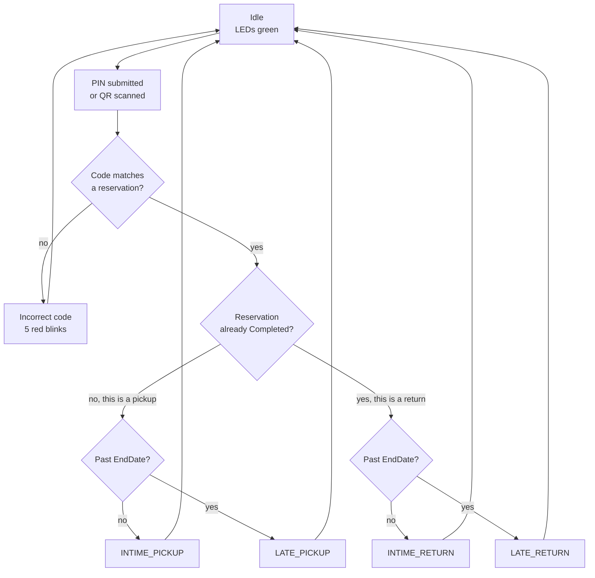
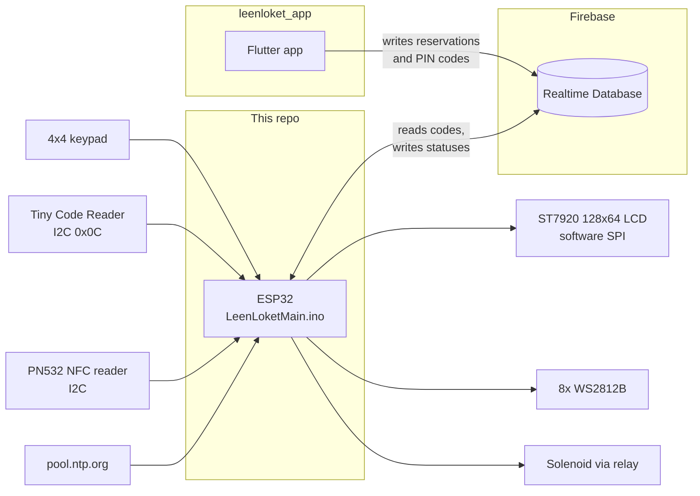

<p align="center">
  
</p>

<h3 align="center">Firmware for the LeenLoket self-service lending locker.</h3>

<p align="center">
  An ESP32 sitting inside a lockable cabinet. Type a 4-digit PIN or hold up a QR code,
  and if the Firebase database agrees you have a booking, the solenoid opens.
</p>

---

This is the hardware half of LeenLoket, a self-service tool library. The other half is
[**leenloket_app**](https://github.com/danieltyukov/leenloket_app), a Flutter app where
you browse items, book one for a date range and pay from a prepaid balance. Booking
produces a PIN and a QR code. This firmware is what those open.

The two halves never speak to each other. They share a Firebase Realtime Database, and
that is the entire integration surface.

## What the box does

At boot it draws its logo, joins WiFi, signs in to Firebase as a device account and
syncs the clock over NTP. The splash below is not a mock; it is the 128x64 XBM bitmap
embedded in `LeenLoketMain.ino`, decoded straight out of the source.

<p align="center">
  
</p>

Then it sits idle, LEDs green, waiting for input:

```
+--------------------------------------+
| Welcome to LeenLoket             [#] |
| Enter your PIN:                      |
|                                      |
| ****                                 |
|                                      |
|                                      |
|--------------------------------------|
| * Reset  |  # Enter | A Scan         |
+--------------------------------------+
```

`*` clears what you typed, `#` submits it, `A` toggles the QR scanner. Digits echo as
asterisks. The `[#]` in the corner is the 19x19 version of the same logo.

## The one rule that makes it work

There is no "I am returning this" button. The locker works out what you are doing from
two fields it reads out of the database, the reservation's status and the item's status:



What each outcome does:

| Outcome | Database writes | At the box |
|---|---|---|
| `INTIME_PICKUP` | item to `Unavailable`, reservation to `Completed` | Unlocks, greets you by name, shows the return deadline |
| `LATE_PICKUP` | reservation to `Completed` | Shows that the reservation expired. **Stays locked** |
| `INTIME_RETURN` | item back to `Available` | Unlocks, waits for the item's NFC tag, relocks |
| `LATE_RETURN` | item back to `Available` | Shows the item came back late, then unlocks and waits for the tag |

So the same four digits work twice: once to take the drill out, once to put it back. The
first use flips the reservation to `Completed`, which is exactly what makes the second
use read as a return.

A late pickup is the only path that does not open the door. A late return still opens,
because refusing to accept an item back helps nobody.

## Where it fits



The device reads `/Codes` to turn a typed PIN into a reservation ID. The QR path skips
that lookup, because the app encodes the reservation ID directly into the QR image.

## Hardware

| Part | Interface | Pins |
|---|---|---|
| ST7920 128x64 LCD | software SPI | clock `D13`, data `D11`, CS `D10`, reset `D8` |
| 4x4 matrix keypad | GPIO | rows `D9` `D8` `D7` `D6`, columns `D5` `D4` `D3` `D2` |
| Useful Sensors Tiny Code Reader (QR) | I2C, address `0x0C` | shared `Wire` bus |
| PN532 NFC reader | I2C | shared `Wire` bus |
| WS2812B strip, 8 LEDs | single wire | `GPIO 47` |
| Solenoid lock via relay | GPIO | `A3` |

The sketch uses Arduino `Dx`/`Ax` pin aliases together with `GPIO 47`, so it is built
for an ESP32-S3 class board with a Nano-style variant. Select your own board in the IDE
before flashing.

**The lock is fail-secure.** `LOW` holds it locked and `HIGH` releases it, so a power cut
leaves the cabinet shut rather than open.

The keypad's physical layout, as the user sees it:

```
   +---+---+---+---+
   | 1 | 2 | 3 | A |   A  toggle QR scanner
   +---+---+---+---+
   | 4 | 5 | 6 | B |
   +---+---+---+---+
   | 7 | 8 | 9 | C |
   +---+---+---+---+
   | * | 0 | # | D |   *  clear    # submit
   +---+---+---+---+
```

`B`, `C` and `D` are unused. Note that the `keys[][]` array in the sketch is written
transposed relative to this, so array rows are physical columns.

The LED ring is the status indicator: red while booting, green when idle and ready,
blue while the lock is open, and five red blinks on a rejected code.

## Libraries

Install these through the Arduino Library Manager:

- `Firebase Arduino Client Library for ESP8266 and ESP32` (mobizt)
- `FastLED`
- `U8g2`
- `Keypad`
- `NDEF` / `PN532` I2C driver, providing `PN532_I2C.h`, `PN532.h` and `NfcAdapter.h`

`tiny_code_reader.h` is vendored in this repository and needs no installation.

## Flashing it

Before the sketch will do anything useful you have to replace the constants at the top
of `LeenLoketMain.ino`:

```cpp
#define WIFI_SSID     "your-network"
#define WIFI_PASSWORD "your-password"
#define API_KEY       "your-firebase-web-api-key"
#define DATABASE_URL  "https://your-project-default-rtdb.europe-west1.firebasedatabase.app"
```

and the device account further down in `setupFireBase()`:

```cpp
auth.user.email    = "machine1@example.invalid";
auth.user.password = "...";
```

You also need a Realtime Database shaped the way the app writes it, with `/Codes`,
`/Reservations`, `/Items` and `/Users` nodes. See the
[app README](https://github.com/danieltyukov/leenloket_app#data-model) for the schema.

Finally, `RFID1` holds the UID of the NFC tag stuck to the item. A return will not
complete until that exact tag is presented, so put your own tag's UID there.

> **Security note.** `LeenLoketMain.ino` still carries the real WiFi password, Firebase
> web API key and device account password from the original build, both in the current
> file and throughout git history. The Firebase project behind them has been
> deactivated, so they open nothing now. Treat every one of them as burned and do not
> reuse them anywhere.

## Timing and the clock

Late versus on time is decided by comparing NTP time against the reservation's
`EndDate`. Two things are worth knowing:

- The comparison adds a hardcoded `+3600` seconds to UTC. That is correct for Dutch
  winter time and an hour off during summer time.
- `convertDateTimeToEpoch()` is documented as taking ISO 8601, but the `sscanf` format
  it actually uses is `dd-MM-yyyy HH:mm:ss`, matching what the Flutter app writes. Trust
  the code, not the comment.

## Known issues

Honest list, since this was a student build that stopped at the deadline.

- **Returns block forever.** `while (!checkRFID()) {}` spins until the right tag appears.
  Walk away mid-return and the cabinet stays unlocked with the firmware wedged until it
  is power cycled.
- **The pickup unlock windows disagree.** The QR path holds the lock open for 5000 ms,
  the keypad path for 500 ms. Half a second is not enough time to open a door.
- **`D8` is assigned twice**, as the LCD reset line and as keypad row 1.
- **`validateCode()` depends on iteration order.** It walks the flattened `/Codes` JSON,
  sets a flag when a value matches the typed PIN, then grabs the next `ReservationID` it
  sees. It works because `PINCode` sorts before `ReservationID`, not because anything
  guarantees the pairing.
- **`throwErrorState()` prints garbage.** `"ERROR Thrown error code: " + code` is pointer
  arithmetic on a string literal, not concatenation, so the error number is never shown
  and the message comes out truncated.
- **`validateCode()` and `updateStatusFromQRCode()` are near-identical**, roughly ninety
  duplicated lines that drifted apart in the unlock delay noted above.
- The error handling in `throwErrorState()` was never finished; the `TODO` about blinking
  the code out on the LEDs is still open.
- Every device is hardcoded to one cabinet. `Items` carry a `LockerID`, but the firmware
  never checks it against itself, so any locker opens for any valid code.

## Credits

Built in late 2023 and early 2024 by [Daniel Tyukov](https://github.com/danieltyukov) as
the hardware half of LeenLoket. The app lives in
[leenloket_app](https://github.com/danieltyukov/leenloket_app).

Released under the [MIT License](LICENSE).
